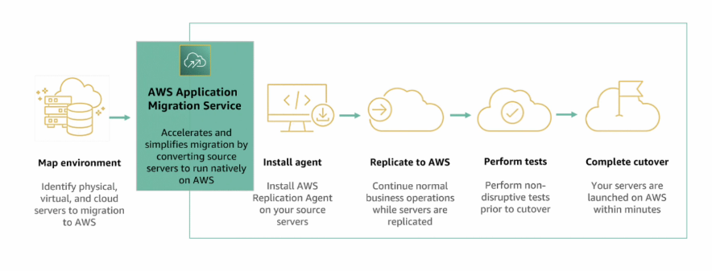

## Domínio 1: Conceitos de nuvem

### Declaração de tarefa 1.1: Definir os benefícios da nuvem AWS.

### Declaração de tarefa 1.2: Identificar os princípios de design da nuvem AWS.

### Declaração de tarefa 1.3: Compreender os benefícios e as estratégias de migração para a nuvem AWS.

- CAF (cloud adoption framework): é um guia que ajuda organizações a migrarem para a nuvem, com o apoio de práticas e diretrizes da aws, seguindo padrões de:

  - negócios
  - pessoas
  - governança
  - plataforma
  - segurança
  - operações.

- aws migration hug: ferramenta centralizada da aws para gerenciar o processo de migração para a nuvem / visibilidade centralizada durante o processo / integra co  outros servilos como DMS/SMS / avaliação de custos e desempenho / pode personalizar métricas,dashboads.

- aws application discovery services: ferramenta que ajuda a bsucar detalhes do ambiente para migrar, ele simplifica a descoberta de recurso (on-premises) / fornece insights sobre recursos atuais.

- aws application migration service: permite que mova aplicativos e servidores para a nuvem da aws / minimiza os riscos durante o processo. / economia de tempo.

- aws database migration service (DMS): serviço de migração de banco de dados, facil e conomica, banco de dados locais para a aws, e da aws para fora da aws banco relacionais / data warehouse / oracle -> oracle / oracle -> amazon aurora.  

### Declaração de tarefa 1.4: Compreender os conceitos dos aspectos econômicos da nuvem.
- Conhecimento de:
  - Aspectos econômicos da nuvem
  - Economia de custos da migração para a nuvem

- Habilidades em:
  - Compreensão da função dos custos fixos em comparação com os custos
variáveis
  - Compreensão dos custos associados a ambientes on-premises
  - Compreensão das diferenças entre as estratégias de licenciamento (por
exemplo, o modelo Bring-Your-Own-License [BYOL] comparado com as
licenças incluídas)
  - Compreensão do conceito de dimensionamento correto
  - Identificação dos benefícios da automação
  - Compreensão dos aspectos econômicos do dimensionamento (por exemplo,
economia de custos)