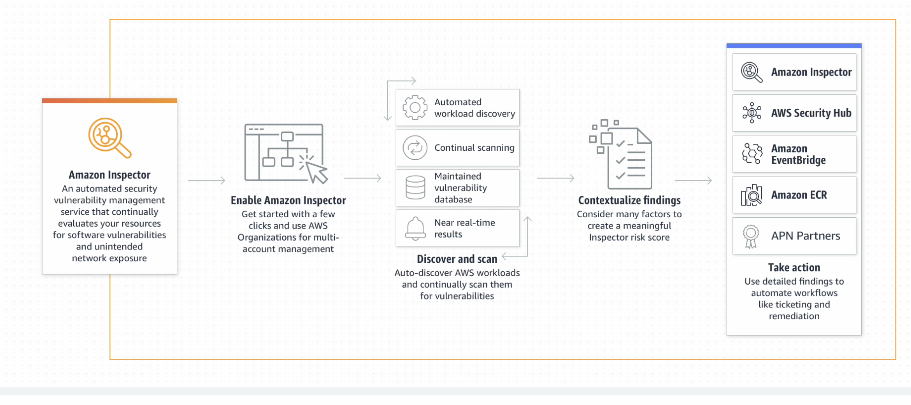

## Domínio 2: Segurança e conformidade

### Declaração de tarefa 2.1: Compreender o modelo de responsabilidade compartilhada da AWS.

- amazon inspector: automatiza updates de segurança, serviço de segurança, busca vulnerabilidades, praticas de segurança. em instâncias do aws ec2.

  - base de dados de vulnerabilidades
  - relatórios detalhados que ajudam a descrever as vuln, classificações de cve
  - avaliação continua de forma proativa, garantindo a correção.
  - integração com outros serviços da aws.

- amazon guardduty: serviço de segurança da aws, usa aprendizado de máquina, detecção de anomalias e inteligência integrada
  - ele procura por sinais de tentativas de acesso, comportamento anomalo de rede.

- aws shield: serviço contra ataque de ddos, ajuda a proteger e manter os serviços. detecta automaticamente, instancias aws ec2, balanceador de cargas.

- aws security hub: painel centralizado para ver os alertas e dados de segurança das contas aws, consolida alertas de varios serviços, usa regras de praticas de segurança, padrões de segurança cis benchmark.

- aws kms: serviço que ajuda gerar e armazenar chaves criptograficas, gerenciamento que controle e acessa protegendo os dados na aws.

- amazon macie: usado para proteger com segurança a privacidade dos dados usando aprendizado de maquina em CPF e senhas por exemplo.

- aws artifact:  portal de autoatendimento que fornece acessos a documentos de conformidade da aws, relatórios de audotoria, ISO, PCI DSS

- aws cloudtrail: manter registro detalhado dentro da conta aws, login, que operação foi realizada dentro de um log que pode ser acessado. (log de eventos), pode criar alertas, integrar com outros recursos com base nos eventos.

- aws service catalog: ajuda a ter um controlde de catalagos de serviços para empresas, garante que recursos sejam usados de forma segura, prateleira virtual, maquinas virtuais, sistema de armazenamrnto, pode pegar os itens direto e começar a usar.

- aws system manager: ferramenta que ajuda a simplificara gestão de infra na nuvem, ajuda na melehoria do gerenciamento da infra, garantindo mais segurança. teste. teste
