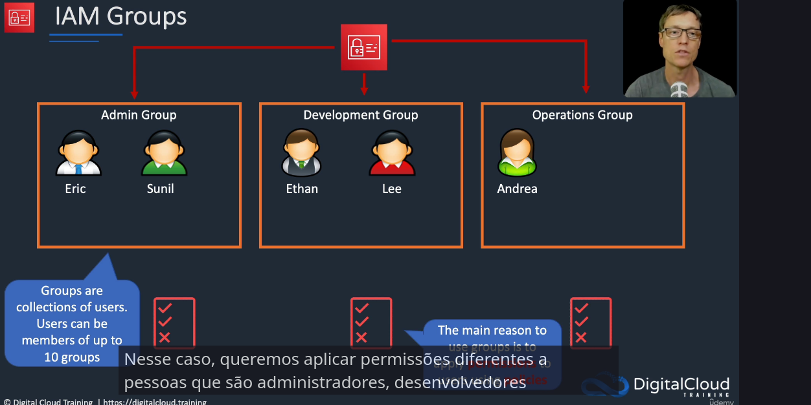
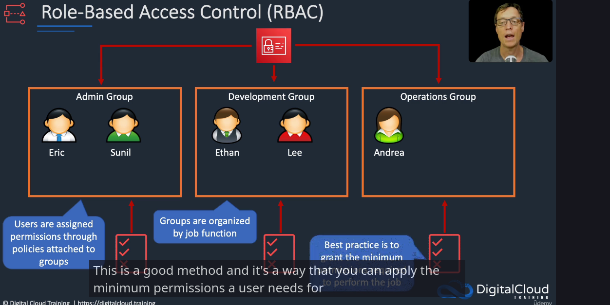
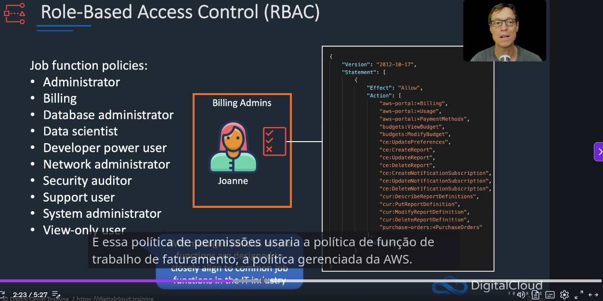

teste

teste

### IAM Groups

### IAM roles

## Politicas
### Tipos de politicas
- aws managed: policy pronta direto da aws mas muti amplas.
- customer managed: criada pelo usuário, ideal para minimo privilegio.
- inline policy: acopladas a um usuário, mas dificil de auditar.

## RBAC
sasas

sasasas
